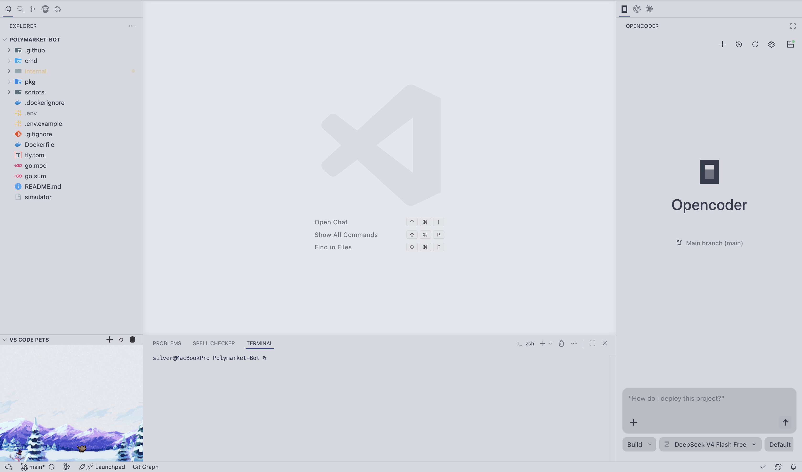
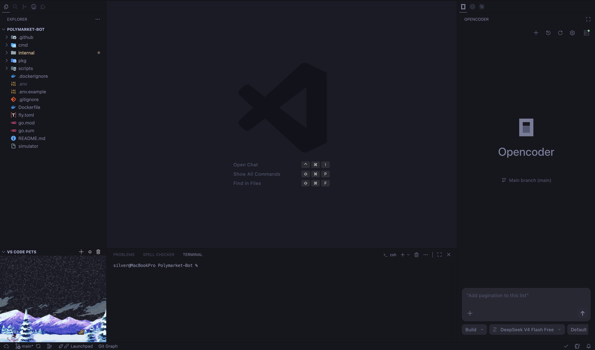
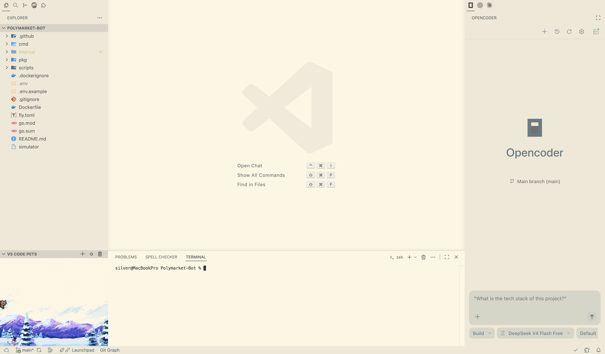
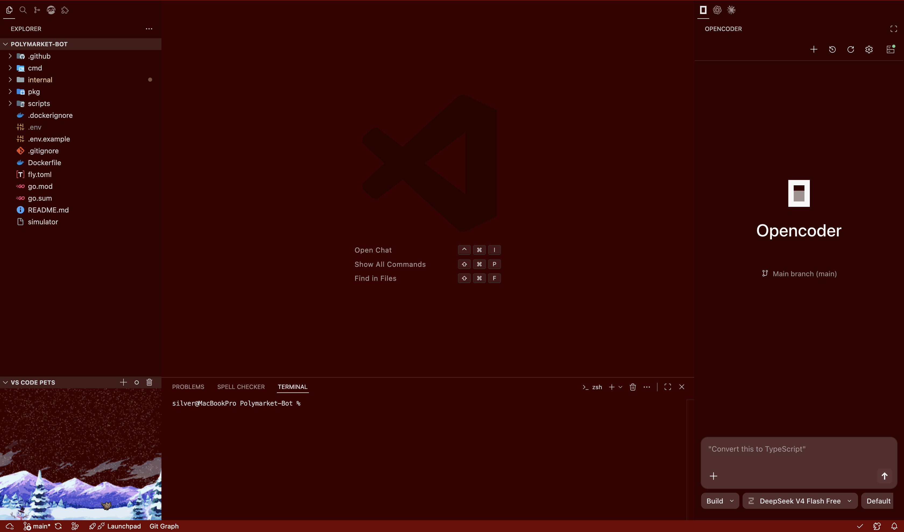

# Opencoder

Access OpenCode AI directly in VS Code with a sidebar extension.

## Features

- 🎯 **Easy access** — OpenCode sessions right in the VS Code sidebar
- ⚡ **Auto-setup** — Automatically installs the CLI on first use
- 🔄 **Multi-session** — Manage multiple OpenCode sessions at once
- 🎨 **Customizable** — Adjust themes, fonts, and colors to your preference
- 📱 **Works everywhere** — Supports Windows, macOS, and Linux

## Screenshots

### Light Theme

### Dark Theme

### Lighter Theme

### Red Theme

## How to Use

1. Install the extension
2. Click the **Opencoder** icon in the VS Code activity bar
3. Create or switch between OpenCode sessions
4. Start coding!

That's it. The extension handles everything else automatically.

## Keyboard Shortcuts

- **Focus sidebar**: <kbd>Cmd</kbd>+<kbd>Shift</kbd>+<kbd>Alt</kbd>+<kbd>.</kbd> (macOS) or <kbd>Ctrl</kbd>+<kbd>Shift</kbd>+<kbd>Alt</kbd>+<kbd>.</kbd> (Windows/Linux)
- **New session**: <kbd>Cmd</kbd>+<kbd>Shift</kbd>+<kbd>Alt</kbd>+<kbd>O</kbd> (macOS) or <kbd>Ctrl</kbd>+<kbd>Shift</kbd>+<kbd>Alt</kbd>+<kbd>O</kbd> (Windows/Linux)
- **Switch session**: <kbd>Cmd</kbd>+<kbd>Shift</kbd>+<kbd>Alt</kbd>+<kbd>S</kbd> (macOS) or <kbd>Ctrl</kbd>+<kbd>Shift</kbd>+<kbd>Alt</kbd>+<kbd>S</kbd> (Windows/Linux)

## Requirements

- VS Code 1.96.0 or newer
- Node.js (optional, for automatic CLI installation)

## Support

For issues or feedback, visit the [GitHub repository](https://github.com/SilverC0de/Opencoder).

## License

MIT — see [LICENSE](LICENSE) for details.
